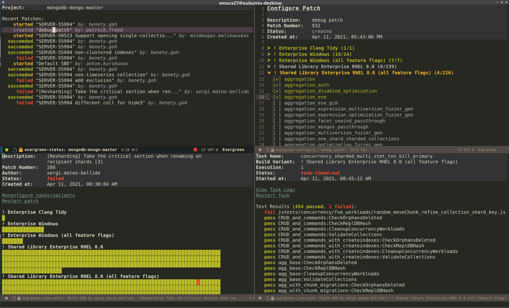
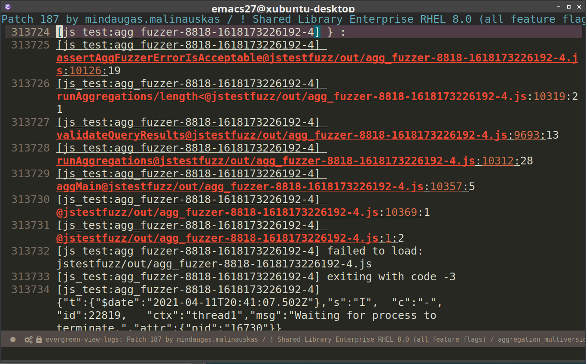

# evg.el

A frontend for the [Evergreen CI system](https://github.com/evergreen-ci/evergreen), implemented as an Emacs
package. The keybindings and appearance take heavy inspiration from [`magit`](https://github.com/magit/magit),
[`dired`](https://www.gnu.org/software/emacs/manual/html_node/emacs/Dired.html), and, of course, the Evergreen web UI
itself.

## Features
The package currently supports the following features:
- viewing a list of recent patches
- viewing patch results
  - includes both grid results (like in the web UI) and text-based results for easy searching
- viewing task results and logs
- viewing test results and logs
- creating, configuring, and scheduling new patches
- reconfiguring existing patches
- aborting patches and tasks
- restarting patches and tasks
- [`evil`](https://github.com/emacs-evil/evil) keybindings, if applicable

## Future Work

The package does not yet support the following features, but will in some future release:
- viewing the waterfall
- support viewing previous executions
- Lobster-like log viewing experience
- auto-updating results buffers
- spawn host management
- viewing diffs for a given patch
- general feature compatibility with the web UI

For more info on what's coming up next, check out the [`todo.org`](./todo.org) file.

Have a feature request or bug report, please [file a GitHub
issue](https://github.com/patrickfreed/evg.el/issues)!

## Installation

Download the latest release tarball from the "Releases" tab on GitHub and use <kbd>M-x package-install-file</kbd> on it.

The Evergreen CLI tool must also be installed and accessible via `$PATH`, and the `~/evergreen.yml` file must be filled
with the proper credentials.

## Commands

<kbd>M-x evg-status</kbd>: Brings up the `evg-status` buffer for an Evergreen project, prompting for the
name. If using Projectile, this will default to the name of the project where this command was invoked.
- A suggested binding for this command is <kbd>C-c e</kbd>.

<kbd>M-x evg-patch</kbd>: Create a new patch of the current project, prompting for a description. Switches to a
new buffer for configuring the tasks to be run as part of the patch.
- This doesn't necessarily need to be bound, since it can be easily invoked from a project's `evg-status` buffer.

## Overview

Like `magit`, `evg` makes use of many different specialized buffers for different tasks. These buffers can be
navigated to and from by selecting different things in a buffer via <kbd>RET</kbd> or by invoking commands. After moving
from one `evg` buffer to the next, the previous `evg` buffer can always be reached by pressing
<kbd><</kbd>. The next sections detail the functionality of each of these specialized buffers and list their key
bindings. 

### The evg-status buffer

Each project has what is called a "status buffer", modeled after the `magit` status buffer for a git repository, which
can be reached via <kbd>M-x evg-status</kbd>. The status buffer serves as a "homepage" for the project, containing
basic information and allowing different actions to be taken using the project.  

Currently, the status buffer displays a list of recent patches for a given project, and those patches may be inspected
by moving the cursor over them and pressing <kbd>RET</kbd>. Patches may also be created from this buffer by pressing
<kbd>p</kbd>.

#### Keymap
- <kbd>p</kbd>: executes `evg-patch`
- <kbd>RET</kbd>: if pressed while the point is over a patch, view the patch's results
- <kbd>r</kbd>: refresh the buffer by fetching the recent patches from Evergreen again

### The evg-configure buffer

This buffer is used to configure a new patch or to reconfigure an existing one. It can be used to select which tasks on
which variants are to be scheduled as part of a patch build. Each variant is listed along with the number of scheduled
tasks out of the total tasks for that variant. Variants may be expanded and hidden by using moving the cursor over them
and hitting <kbd>TAB</kbd>. Tasks and variants may be marked for scheduling using <kbd>m</kbd> and unmarked using
<kbd>u</kbd> (similar to `dired`). The updates are applied by hitting <kbd>x</kbd>.

#### Keymap
- <kbd>m</kbd>: marks the variant or task under the point for scheduling. If on a variant, it marks all the tasks on
  that variant for scheduling. If pressed on a task or variant that is already marked, it has no effect.
- <kbd>u</kbd>: unmarks the variant or task under the point for scheduling. If on a variant, it unmarks all the tasks on
   that variant for scheduling. If pressed on a task or variant that is already unmarked, it has no effect.
- <kbd>TAB</kbd>: if pressed while the point is on a variant, shows/hides the task list for that variant.
- <kbd>x</kbd>: submit the patch configuration to Evergreen, scheduling the patch and any marked tasks. This will also
  unschedule any previously scheduled tasks if they were unmarked.

  
### The evg-view-patch buffer

This buffer is used to view the results of a patch. By default, it will show a grid for each variant included in the
patch, with colored rectangles representing the various tasks for each variant. They are colored according to their
results using the same coloring scheme that the Evergreen web UI uses, albeit according to the theme used by
Emacs. Moving the cursor over the rectangles will cause the name and result of the task to be printed in the echo area,
and a task can be inspected by pressing <kbd>RET</kbd> while the point is over one of the rectangles. 

The task results can also be viewed in a text-based mode, which may be easier to search through. Pressing <kbd>d</kbd>
switches the buffer between text and grid mode.  

The cursor can be moved automatically to the next failure by pressing <kbd>M-n</kbd> (<kbd>M-j</kbd> in evil-mode) and
to the previous one by pressing <kbd>M-p</kbd> (<kbd>M-k</kbd> in evil-mode). This works when viewing the results in
either grid or text mode.

The patch can be aborted (if it is in progress) by hitting the `Abort Patch` button. Similarly, if the patch has already
finished, it can be restarted by hitting the `Restart Patch` button.

#### Keymap
- <kbd>r</kbd>: refresh the buffer with the latest results from Evergreen
- <kbd>M-n</kbd>: move the cursor to the next failure (<kbd>M-j</kbd> if evil-mode is enabled)
- <kbd>M-p</kbd>: move the cursor to the previous failure (<kbd>M-k</kbd> if evil-mode is enabled)
- <kbd>d</kbd>: switch the results display between grid and text mode
- <kbd><</kbd>: go back to the evg-status buffer for this project

### The evg-view-task buffer

This buffer is used to display the results of an individual task. If available, the test results for that task will also
be displayed. The logs for an individual test can be viewed by moving the cursor over the test and pressing
<kbd>RET</kbd>. The entire task's logs can be viewed by pressing the `View Task Logs` button. If the task is in
progress, it can be aborted by pressing the `Abort Task` button. Similarly, if the task has already completed, it can be
restarted by pressing `Restart Task`. If the task has multiple executions, the latest one is always displayed.

#### Keymap
- <kbd>r</kbd>: refresh the buffer with the latest results from Evergreen
- <kbd><</kbd>: go back to the evg-view-patch buffer for the patch this task belongs to

### The evg-view-logs buffer

This buffer is used to display the logs of a given task or test, the name of which is displayed in the header of the
buffer. The logs are viewed in `compilation-mode`, which should highlight any errors detected in the logs.

#### Keymap
- <kbd><</kbd>: go back to the evg-view-task buffer for the patch these logs belong to

